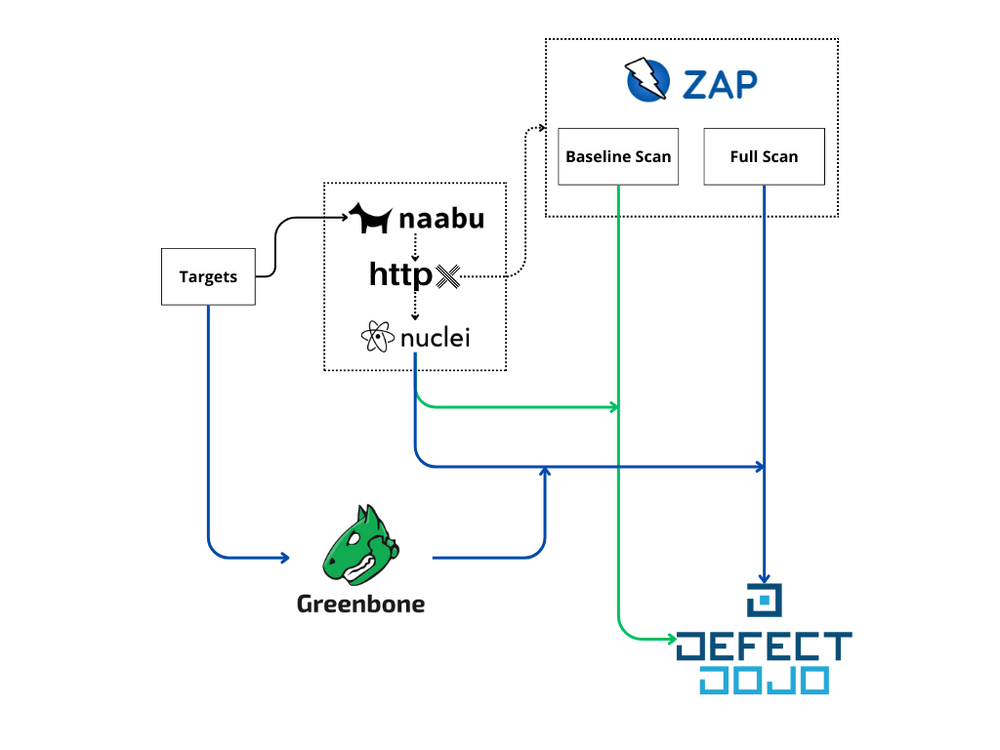

# Overview

## Introdution

Modern cloud infrastructure security is a complex and critical aspect of maintaining robust and resilient cloud services. Moreover, as organizations increasingly rely on cloud environments for their operations, the security of these infrastructures becomes paramount.

The SCS Software stack, and more specifically its Infrastructure-as-a-Service layer, is susceptible to various security threats, including but not limited to misconfigurations, vulnerabilities and external attacks. To address these concerns, continuous and automated security testing is essential.

## Cloud Security Concerns

Cloud infrastructure security involves protecting data, applications, and services from unauthorized access and threats. Key concerns include:

- **Data Breaches**: Unauthorized access to sensitive data.
- **Misconfigurations**: Incorrect settings that expose systems to  vulnerabilities.
- **Compliance Violations**: Failure to meet regulatory and industry standards.
- **Advanced Persistent Threats (APTs)**: Prolonged and targeted cyber-attacks.
- **Insider Threats**: Malicious actions by authorized users.

To mitigate these risks, security practices like Static Application Security Testing (SAST) and Dynamic Application Security Testing (DAST) are employed. However, if you look at it from an automation perspective, a basic distinction of tooling is needed to be considered:

- SAST involves analyzing the source code, bytecode, or binary code of applications to identify vulnerabilities without executing them. It helps in detecting issues like SQL injection, XSS, and other code-related vulnerabilities early in the development lifecycle.

- DAST involves testing the application in its running state, as well as deployed infrastructure, to identify vulnerabilities that could be exploited in real-time. It focuses on the application's exposed interfaces and is crucial for detecting issues like authentication problems, server misconfigurations, and injection flaws.

In this project we solely focus on DAST.

## SCS automated pentesting

The automated pentesting pipeline is based on a proposed methodology for the Sovereign Cloud Stack community. It integrates state-of-the-art tools to conduct dynamic security testing and ensure continuous security assurance for SCS based cloud infrastructures.

The pipeline has been developed from a DevSecOps perspective, which ensures that security is deeply embedded into the fabric of the cloud infrastructure. It aligns with the following principles:

- **Integrated Security Testing**: The pipeline integrates DAST tools directly into the workflow managed by SCS Zuul. This ensures that every target is automatically tested for security vulnerabilities.
- **Continuous Monitoring**: Scheduled daily and weekly scans maintain continuous oversight of the infrastructure’s security posture, ensuring that any new vulnerabilities are quickly identified and addressed.
- **Automated Feedback Loop**: The results from security tests are automatically fed back to the a central vulnerabilities repository, enabling quick remediation and continuous improvement.
- **Cultural Shift**: By adopting a DevSecOps approach, the pipeline fosters a culture where security is a shared responsibility, encouraging all team members to prioritize and contribute to security efforts.

Following this approach, each each tool has it's own use case and they build up onto each other over two different pipelines: A fast daily scan and a comprehensive weekly scan. 

- **Naabu** -> Identify open ports
- **Httpx** -> Identify web services from previous result
- **Nuclei** -> Scan web services based on community templates
- **ZAP Proxy** -> Scan web services based on OWASP rulesets
- **Greenbone** Community Edition (OpenVAS) -> Full scan targets
- **Defect Dojo** -> Vulnerabilities management
  

Color meaning:

- Green: Daily triggered pipeline
- Blue: Weekly triggered pipeline

## Quickstart Guide

See [the quickstart page](./quickstart.md).

## Tools

See [the tools page](./tools.md).

## Source

[github.com/SovereignCloudStack/security-infra-scan-pipeline](https://github.com/SovereignCloudStack/security-infra-scan-pipeline).